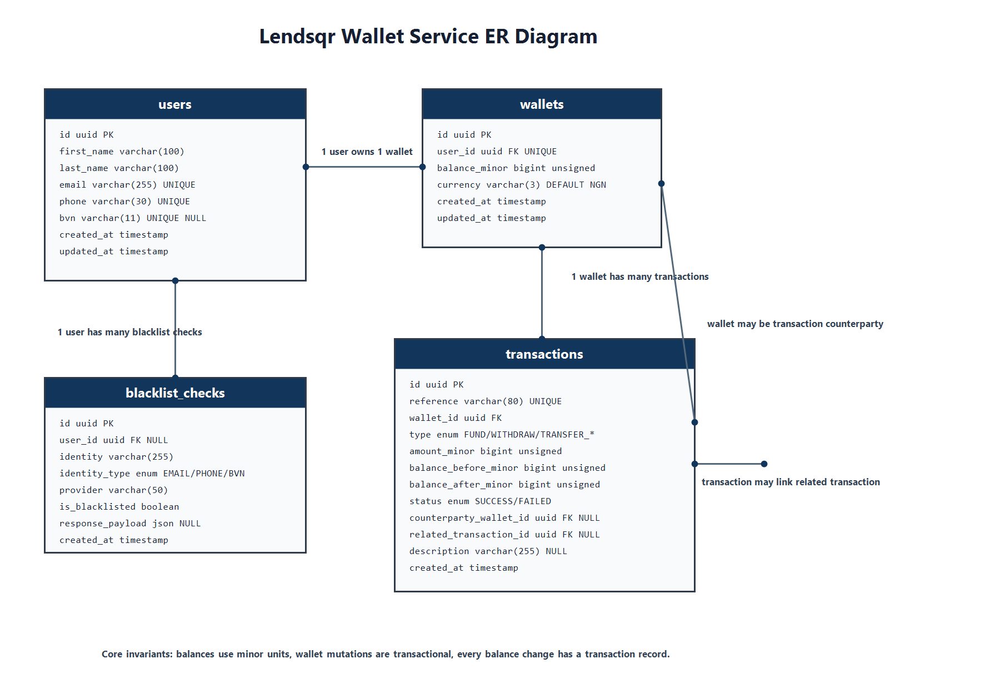

# Lendsqr Wallet Service

This project implements a wallet MVP for Demo Credit, a lending application. The system is designed around financial correctness, auditability, and safe wallet mutations. Although this is an MVP, wallet operations are treated as financial state transitions rather than ordinary CRUD updates.

## Status

Current milestone: Milestone 11 - README and Documentation implemented.

Next milestone: Milestone 12 - Deployment.

Deployment URL: pending Milestone 12.

## Problem Statement

Demo Credit needs a backend wallet service that allows eligible users to receive, hold, move, and withdraw funds. The service must prevent blacklisted users from onboarding through the Adjutor Karma blacklist check and must keep a durable audit trail for every wallet balance change.

The guiding invariant is:

```text
A wallet balance should never change without a durable transaction record explaining why it changed.
```

## Assessment Requirement Mapping

| Requirement                 | Implementation                                     | Status      |
| --------------------------- | -------------------------------------------------- | ----------- |
| Node.js backend             | Express API on Node.js LTS                         | Implemented |
| TypeScript                  | Strict TypeScript project setup                    | Implemented |
| KnexJS                      | Knex migrations and repository queries             | Implemented |
| MySQL                       | MySQL schema, constraints, and transaction support | Implemented |
| Create user account         | `POST /api/v1/users`                               | Implemented |
| Wallet creation             | One wallet created during onboarding               | Implemented |
| Fund wallet                 | `POST /api/v1/wallets/:walletId/fund`              | Implemented |
| Withdraw funds              | `POST /api/v1/wallets/:walletId/withdraw`          | Implemented |
| Transfer funds              | `POST /api/v1/wallets/:walletId/transfers`         | Implemented |
| Transaction history         | `GET /api/v1/wallets/:walletId/transactions`       | Implemented |
| Karma blacklist check       | Adjutor client isolated behind blacklist service   | Implemented |
| Faux authentication         | `x-user-id` request header middleware              | Implemented |
| Positive and negative tests | Jest and Supertest coverage                        | Implemented |
| README and ER diagram       | Design document plus `docs/er-diagram.png`         | Implemented |
| Public deployment           | Cloud-hosted API URL                               | Pending     |
| Public documentation page   | Google Doc or Notion page                          | Pending     |
| Loom review video           | Under 3 minutes                                    | Pending     |

## Architecture Overview

The codebase uses a simple layered architecture:

- HTTP layer: Express routes, controllers, request validation, faux auth, and error handling.
- Application layer: Services that own business rules and transaction orchestration.
- Persistence layer: Repositories that hide Knex queries and receive transaction scopes.
- External integration layer: Adjutor Karma API client and blacklist service.
- Shared layer: response helpers, operational errors, money helpers, and logger.

Important folders:

```text
src/
  app.ts
  server.ts
  config/
  database/
  middlewares/
  modules/
    blacklist/
    transactions/
    users/
    wallets/
  shared/
  tests/
docs/
  api-examples.md
  er-diagram.md
  er-diagram.png
```

## Database Design

The schema is intentionally small and ledger-oriented. Wallets hold current balance, while transactions explain every balance movement.

### `users`

Stores onboarded customers.

| Column       | Notes                  |
| ------------ | ---------------------- |
| `id`         | UUID primary key       |
| `first_name` | Required               |
| `last_name`  | Required               |
| `email`      | Required and unique    |
| `phone`      | Required and unique    |
| `bvn`        | Nullable and unique    |
| `created_at` | Timestamp              |
| `updated_at` | Auto-updated timestamp |

### `wallets`

Stores current wallet balances.

| Column          | Notes                                                |
| --------------- | ---------------------------------------------------- |
| `id`            | UUID primary key                                     |
| `user_id`       | Foreign key to users; unique for one wallet per user |
| `balance_minor` | Unsigned BIGINT, defaults to `0`                     |
| `currency`      | Defaults to `NGN`                                    |
| `created_at`    | Timestamp                                            |
| `updated_at`    | Auto-updated timestamp                               |

The table has a `balance_minor >= 0` check constraint.

### `transactions`

Stores the durable audit trail for wallet movements.

| Column                   | Notes                                                |
| ------------------------ | ---------------------------------------------------- |
| `id`                     | UUID primary key                                     |
| `reference`              | Unique transaction reference                         |
| `wallet_id`              | Wallet affected by this transaction                  |
| `type`                   | `FUND`, `WITHDRAW`, `TRANSFER_IN`, or `TRANSFER_OUT` |
| `amount_minor`           | Positive unsigned BIGINT                             |
| `balance_before_minor`   | Balance before movement                              |
| `balance_after_minor`    | Balance after movement                               |
| `status`                 | `SUCCESS` or `FAILED`                                |
| `counterparty_wallet_id` | Optional wallet on the other side of a transfer      |
| `related_transaction_id` | Optional self-reference for linked transfer legs     |
| `description`            | Optional description                                 |
| `created_at`             | Timestamp                                            |

### `blacklist_checks`

Stores evidence of Adjutor Karma checks.

| Column             | Notes                         |
| ------------------ | ----------------------------- |
| `id`               | UUID primary key              |
| `user_id`          | Nullable foreign key to users |
| `identity`         | Email, phone, or BVN checked  |
| `identity_type`    | `EMAIL`, `PHONE`, or `BVN`    |
| `provider`         | Defaults to `ADJUTOR_KARMA`   |
| `is_blacklisted`   | Boolean result                |
| `response_payload` | Raw provider response payload |
| `created_at`       | Timestamp                     |

## ER Diagram



Diagram source is available in [docs/er-diagram.md](docs/er-diagram.md).

## API Documentation

Base URL for local development:

```text
http://localhost:3000
```

Full request and response examples are in [docs/api-examples.md](docs/api-examples.md).

| Method | Path                                     | Auth        | Purpose                         |
| ------ | ---------------------------------------- | ----------- | ------------------------------- |
| `GET`  | `/health`                                | No          | Service health check            |
| `POST` | `/api/v1/users`                          | No          | Onboard user after Karma check  |
| `GET`  | `/api/v1/wallets/:walletId`              | `x-user-id` | Get owned wallet                |
| `POST` | `/api/v1/wallets/:walletId/fund`         | `x-user-id` | Simulate wallet funding         |
| `POST` | `/api/v1/wallets/:walletId/withdraw`     | `x-user-id` | Simulate wallet withdrawal      |
| `POST` | `/api/v1/wallets/:walletId/transfers`    | `x-user-id` | Transfer to another wallet      |
| `GET`  | `/api/v1/wallets/:walletId/transactions` | `x-user-id` | List wallet transaction history |

### Standard Success Response

```json
{
  "success": true,
  "message": "Wallet funded successfully",
  "data": {}
}
```

### Standard Error Response

```json
{
  "success": false,
  "message": "Insufficient wallet balance",
  "errorCode": "INSUFFICIENT_FUNDS"
}
```

Validation errors also include a `details` array.

## Authentication Approach

Full authentication is out of scope for the assessment. The MVP uses faux authentication through an `x-user-id` request header. Wallet endpoints compare the authenticated user ID from the header against the wallet owner before returning or mutating wallet data.

Missing auth returns `401`. Cross-wallet access returns `403`.

## Karma Blacklist Integration

User onboarding checks Adjutor Karma before creating a user or wallet.

Implementation details:

- `AdjutorClient` calls `GET /verification/karma/:identity`.
- The API key is passed as `Authorization: Bearer <ADJUTOR_API_KEY>`.
- `BlacklistService` persists successful lookup evidence in `blacklist_checks`.
- Email and phone are always checked.
- BVN is checked when provided.
- A Karma response with data is treated as blacklisted.
- A provider `404` is treated as a completed lookup with no blacklist match.
- Missing API key, network failure, and non-404 provider errors fail closed with `BLACKLIST_PROVIDER_UNAVAILABLE`.

Failing closed is intentional for a lending product: if blacklist verification cannot be completed, the user is not onboarded.

## Wallet Consistency and Transaction Scoping

Wallet balance mutations are implemented as financial state transitions.

- Amounts are stored in minor units, not floating-point values.
- Funding, withdrawal, and transfer run inside database transactions.
- Wallet rows are locked with `FOR UPDATE` before mutation.
- Funding creates a `FUND` transaction.
- Withdrawal creates a `WITHDRAW` transaction.
- Transfer creates linked `TRANSFER_OUT` and `TRANSFER_IN` records.
- Transfers lock wallets in deterministic wallet ID order to reduce deadlock risk.
- If any step in a transfer fails, the database transaction rolls back.

Core invariants:

- A blacklisted user must never be onboarded.
- A user must not be created without a wallet.
- A wallet balance must never be negative.
- Every balance change must create a transaction record.
- Transfers must be atomic.
- A failed transfer must not debit the sender.
- A failed transfer must not credit the recipient.
- A user must not operate on another user's wallet.
- Amounts must be positive integer minor units.
- Transaction references must be unique.

## Local Setup

Requirements:

- Node.js `>=20.18.0`
- MySQL `8.x` or compatible
- npm

Install dependencies:

```bash
npm install
```

Create local databases:

```sql
CREATE DATABASE lendsqr_wallet_service;
CREATE DATABASE lendsqr_wallet_service_test;
```

Copy the environment template:

```bash
cp .env.example .env
```

On PowerShell, use:

```powershell
Copy-Item .env.example .env
```

Fill in the database and Adjutor values in `.env`, then run migrations:

```bash
npm run migrate:latest
npm run migrate:status
```

Start the development server:

```bash
npm run dev
```

The server listens on `PORT` and defaults to `3000`.

## Environment Variables

| Variable            | Required                       | Description                          |
| ------------------- | ------------------------------ | ------------------------------------ |
| `NODE_ENV`          | Yes                            | Runtime environment                  |
| `PORT`              | No                             | HTTP server port, defaults to `3000` |
| `DATABASE_HOST`     | Yes                            | MySQL host                           |
| `DATABASE_PORT`     | Yes                            | MySQL port                           |
| `DATABASE_USER`     | Yes                            | MySQL user                           |
| `DATABASE_PASSWORD` | No                             | MySQL password                       |
| `DATABASE_NAME`     | Yes                            | Database name                        |
| `ADJUTOR_BASE_URL`  | Yes                            | Adjutor API base URL                 |
| `ADJUTOR_API_KEY`   | Yes for real onboarding checks | Adjutor API key                      |

See [.env.example](.env.example).

## Migrations

Run latest migrations:

```bash
npm run migrate:latest
```

Check migration status:

```bash
npm run migrate:status
```

Rollback the latest batch:

```bash
npm run migrate:rollback
```

Migrations live in `src/database/migrations`.

## Testing

Run the test suite:

```bash
npm test
```

Run the full local verification gate:

```bash
npm run build
npm test
npm run lint
npm run format:check
```

The current suite covers user onboarding, blacklist behavior, fail-closed provider behavior, wallet detail access, funding, withdrawal, transfers, transaction history, validation failures, authorization boundaries, insufficient funds, transaction record creation, and transfer rollback behavior.

External Adjutor calls are mocked in tests; the test suite does not depend on the real Adjutor API.

## Deployment

Deployment is planned for Milestone 12.

Target URL format:

```text
https://obinna-victor-lendsqr-be-test.<cloud-platform-domain>
```

The final deployed URL will be added here after the cloud environment and production MySQL database are provisioned.

## Tradeoffs and Assumptions

- Faux authentication is used because full auth is explicitly out of scope.
- Each onboarded user receives exactly one NGN wallet.
- Funding is simulated because no payment provider is required.
- Withdrawal is simulated as a wallet debit because no bank payout provider is required.
- Transfers are internal wallet-to-wallet movements.
- Amounts are accepted in minor units to avoid floating-point money errors.
- Adjutor provider failures fail closed during onboarding.
- The transaction table stores successful wallet movements; failed attempts are represented by rejected API responses and rolled-back database changes.
- Current tests mock repositories and external clients for speed and determinism.

## Future Improvements

- Add real authentication and scoped access tokens.
- Add idempotency keys for funding, withdrawal, and transfer requests.
- Add request-level correlation IDs for tracing.
- Add rate limiting and abuse controls.
- Add a real payment provider for funding.
- Add a real payout provider for withdrawals.
- Add DB-backed integration tests in CI with a disposable MySQL service.
- Add structured production logging and metrics.
- Add API documentation publishing with OpenAPI.

## Project Tracking

See [TODO.md](TODO.md) and [docs/assessment-checklist.md](docs/assessment-checklist.md).
